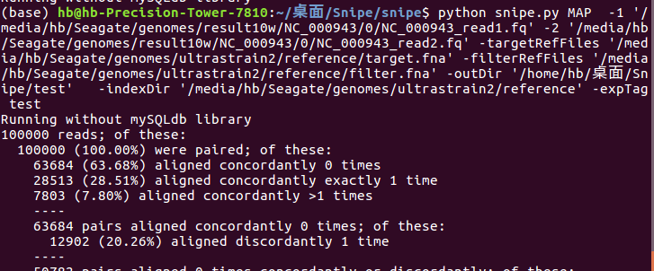

# MAP Module
```
 python snipe.py MAP  -1 '/media/hb/Seagate/genomes/result10w/NC_000943/0/NC_000943_read1.fq' -2 '/media/hb/Seagate/genomes/result10w/NC_000943/0/NC_000943_read2.fq' -targetRefFiles '/media/hb/Seagate/genomes/ultrastrain2/reference/target.fna' -filterRefFiles '/media/hb/Seagate/genomes/ultrastrain2/reference/filter.fna' -outDir '/home/hb/桌面/Snipe/test'   -indexDir '/media/hb/Seagate/genomes/ultrastrain2/reference' -expTag test
```


