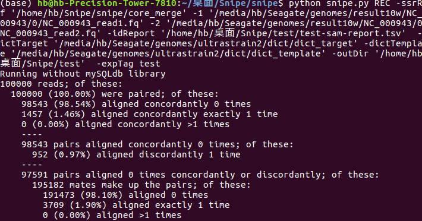

# REC Module
```
python snipe.py REC -ssrRef '/home/hb/Snipe/snipe/core_merge' -1 '/media/hb/Seagate/genomes/result10w/NC_000943/0/NC_000943_read1.fq' -2 '/media/hb/Seagate/genomes/result10w/NC_000943/0/NC_000943_read2.fq' -idReport '/home/hb/桌面/Snipe/test/test-sam-report.tsv'  -dictTarget '/media/hb/Seagate/genomes/ultrastrain2/dict/dict_target' -dictTemplate '/media/hb/Seagate/genomes/ultrastrain2/dict/dict_template' -outDir '/home/hb/桌面/Snipe/test'  -expTag test

```

